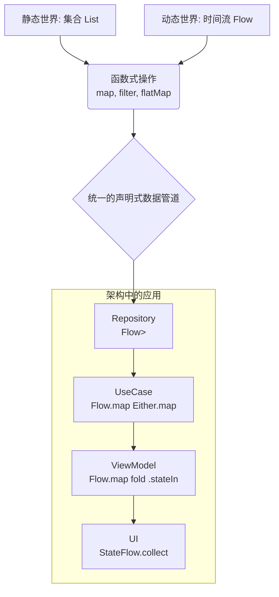
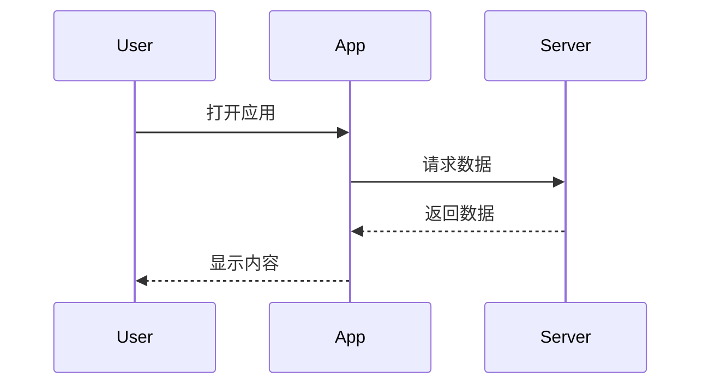
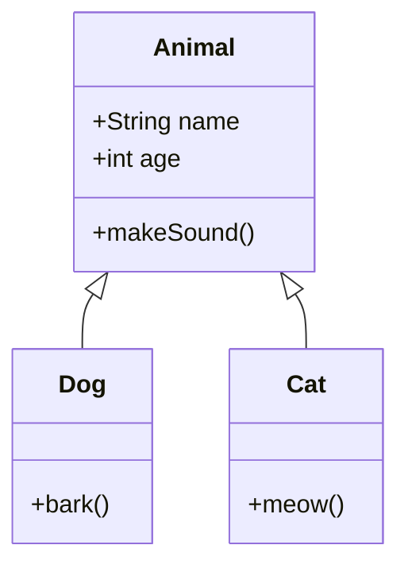

# Mermaid 测试文档

这是一个测试文档，用于验证 Mermaid 图表的渲染。

## 流程图示例

## 序列图示例

## 类图示例

## 测试要点

- [ ] Mermaid 图表应该立即显示，不是代码
- [ ] 编辑文档时图表应该保持稳定
- [ ] 图表不应该在显示后消失
- [ ] 切换主题时图表应该保持显示
- [ ] 公众号预览区的图表应该同步显示

测试完成后，请验证所有图表都能正常显示！
