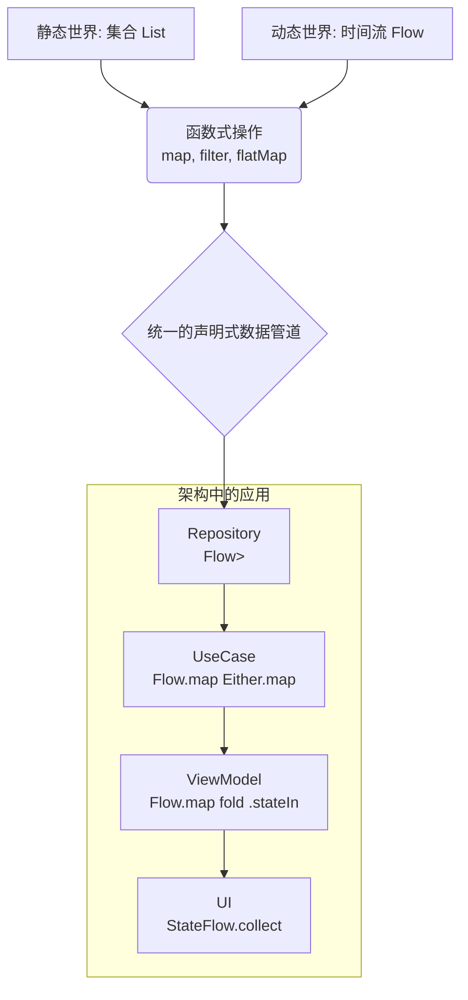
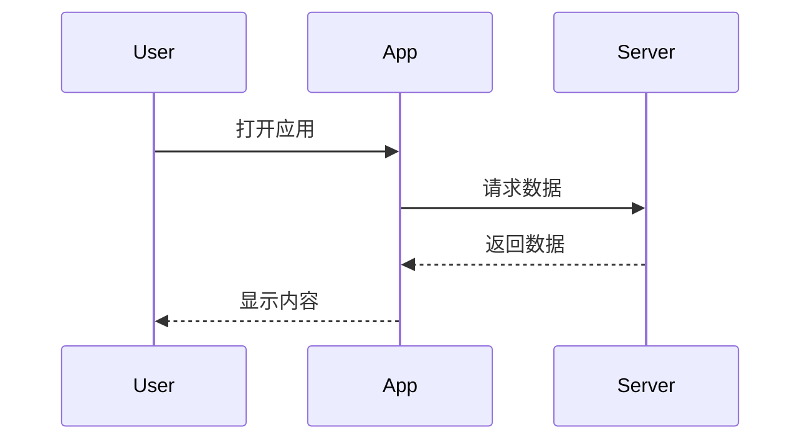
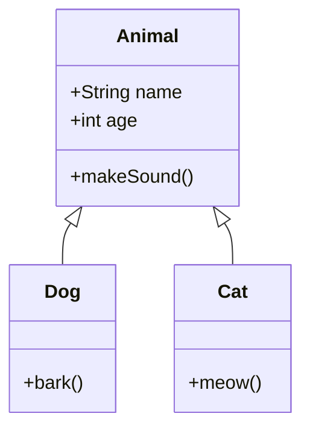

# Mermaid 测试文档

这是一个测试文档，用于验证 Mermaid 图表的渲染。

## 流程图示例



## 序列图示例



## 类图示例



## 测试要点

- [ ] Mermaid 图表应该立即显示，不是代码
- [ ] 编辑文档时图表应该保持稳定
- [ ] 图表不应该在显示后消失
- [ ] 切换主题时图表应该保持显示
- [ ] 公众号预览区的图表应该同步显示

测试完成后，请验证所有图表都能正常显示！

---

## 📂 项目结构

```
LingMD/
├── src/                    # 前端源代码
│   ├── App.jsx            # 主应用组件
│   ├── Editor.jsx         # 编辑器组件
│   ├── Preview.jsx         # 预览组件
│   ├── PreviewWithMermaid.jsx  # 支持 Mermaid 的预览组件
│   ├── Outline.jsx         # 目录组件
│   ├── WechatExport.jsx    # 微信公众号导出组件
│   ├── useMarkdownRenderer.js  # Markdown 渲染 Hook
│   └── useDebounce.js      # 防抖 Hook
├── main/                   # Electron 主进程
│   ├── main.js            # 主进程入口
│   └── preload.js         # 预加载脚本
├── public/                 # 静态资源
│   ├── hljs/              # 代码高亮主题
│   └── fonts/              # 字体文件
├── dist/                   # 构建输出
└── dist_electron/          # Electron 打包输出
```

## 🔧 开发指南

### 开发命令
```bash
# 启动开发服务器（同时启动 React 和 Electron）
npm start

# 仅启动 React 开发服务器
npm run start-react

# 仅启动 Electron（等待 React 服务器就绪）
npm run start-electron

# 构建 React 应用
npm run build-react

# 创建可分发包
npm run dist
```

### 核心组件说明

#### App.jsx
主应用容器，负责：
- 主题切换（Markdown 主题和代码高亮主题）
- 文件操作（新建、打开、保存、自动保存）
- 编辑器与预览区的滚动同步
- 微信公众号导出功能
- Mermaid 图表渲染

#### Editor.jsx
Markdown 编辑器组件，提供：
- 撤销/重做功能（历史记录管理）
- 图片粘贴/上传支持
- 键盘快捷键（Ctrl+Z、Ctrl+Y、Esc）
- 文件处理和图片管理

#### useMarkdownRenderer.js
Markdown 处理 Hook：
- 使用 Markdown-it 解析 Markdown
- 支持 KaTeX 数学表达式
- Mermaid 图表集成
- Highlight.js 语法高亮
- DOMPurify HTML 清理
